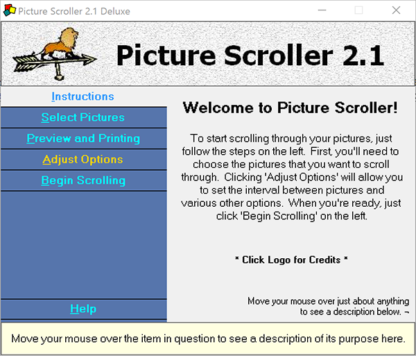

# Overview

This is a very old bit of software that @jdve (my brother) and I made
way back in the late 90s.

Here is the original description taken from the documentation:

>As many computer users have discovered, it can be quite frustrating sorting through
all the pictures he or she may have.  The main purpose of Picture Scroller, therefore,
is to remedy this problem by allowing you to scroll through all the pictures in any
directory that you have on your hard drive or even on a remote drive.  Besides that,
it can scroll through the pictures with 50 different transitions, adding greatly to
the picture scrolling experience!  This could be used to give a slide presentation to
your company, or just to browse through your pictures.  Picture Scroller makes it easy
to view and use any picture that you have acquired from a digital camera, scanner, the
Internet, or even those you have drawn yourself!

# Requirements

* Visual Basic 6.0
    - https://msdn.microsoft.com/en-us/vstudio/ms788229.aspx
    - See http://www.fortypoundhead.com/showcontent.asp?artid=23993 for information on how to install on Windows 10
* InstallShield
    - http://www.flexerasoftware.com/producer/products/software-installation/installshield-software-installer/
* Microsoft HTML Help 1.4
    - https://msdn.microsoft.com/en-us/library/windows/desktop/ms669985(v=vs.85).aspx

# Compiling

1. Open `Source/Picture Scroller Deluxe.vbp`
2. Press Play

Tested this on Windows 10 using Visual Basic 6.0 and it 'just worked'. Previously there was a Lite and Deluxe version, but for simplicity I've removed the Lite version since it was just the Deluxe version with some features removed.